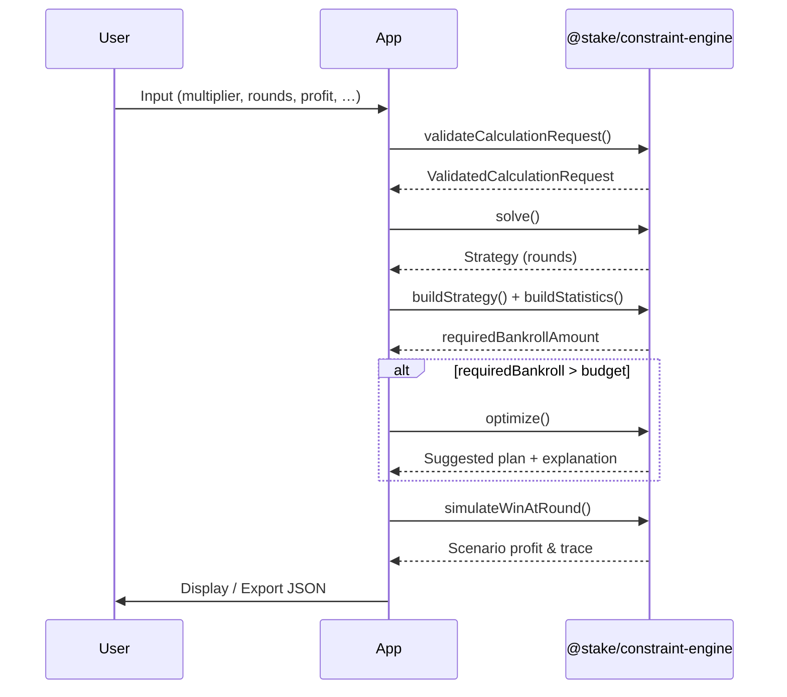

# Calculation Engine SDK

**Constraint-based bankroll planning** — validate input, solve optimal bets, build strategy aggregates, derive statistics, optimize for budget, and run deterministic simulations.

|                    |                                                                            |
| ------------------ | -------------------------------------------------------------------------- |
| **Status**         | Platform-ready — Core + Optimization on `optimization-v1`                  |
| **Public API**     | [`src/public/index.ts`](src/public/index.ts)                               |
| **Package**        | `@stake/constraint-engine`                                                 |
| **License**        | [MIT](LICENSE)                                                             |

> **New here?** Read the [SDK Cookbook](docs/cookbook/README.md) — 5-minute start, common workflows, error mapping.  
> This repository also contains the **Stake Planner** UI (a consumer app). Import only from `@stake/constraint-engine`.

---

## How it fits together



Runnable end-to-end example: `pnpm example:minimal-consumer` → [`examples/minimal-consumer/`](examples/minimal-consumer/index.ts)

---

## Installation

```bash
npm install @stake/constraint-engine
```

Pre-release (monorepo):

```bash
git clone https://github.com/Ekergodmear/manageMoney.git
cd manageMoney
pnpm install
pnpm build:lib
```

Requires **Node.js ≥ 22**.

---

## Quick Start

See **[Getting Started (5 min)](docs/cookbook/README.md)** for the full product workflow.

Minimal generate + simulate:

```typescript
import {
  validateCalculationRequest,
  solve,
  buildStrategy,
  buildStatistics,
  simulateWinAtRound,
} from '@stake/constraint-engine';

const request = {
  rewardMultiplier: 20,
  roundCount: 5,
  minimumBet: 10_000,
  betStep: 1_000,
  targetProfit: { mode: 'fixedAmount', amount: 100_000 },
} as const;

const validated = validateCalculationRequest(request);
if (validated.kind === 'failure') {
  console.error(validated.error);
  process.exit(1);
}

const solved = solve(validated.value);
if (solved.kind === 'failure') {
  throw new Error('solver should not fail on valid input');
}

const strategy = buildStrategy(solved.value.rounds);
const statistics = buildStatistics(strategy);
const simulation = simulateWinAtRound(strategy, 3);

if (simulation.kind === 'success') {
  console.log(statistics.requiredBankrollAmount);
  console.log(simulation.value.winningRoundIndex);
}
```

---

## Capabilities

Six public functions — use cases, not internal layers.

| Function | Recipe |
| -------- | ------ |
| `validateCalculationRequest` | [Generate a plan](docs/cookbook/generate-plan.md) |
| `solve` | [Generate a plan](docs/cookbook/generate-plan.md) |
| `buildStrategy` | [Generate a plan](docs/cookbook/generate-plan.md) |
| `buildStatistics` | [Generate a plan](docs/cookbook/generate-plan.md) |
| `optimize` | [Optimize for bankroll](docs/cookbook/optimize-for-bankroll.md) |
| `simulateWinAtRound` | [Run simulation](docs/cookbook/run-simulation.md) |

Error mapping: [Error Cookbook](docs/cookbook/error-codes.md)

### 1. `validateCalculationRequest`

Trust boundary. Returns `Result<ValidatedCalculationRequest, ValidationResult>`.

```typescript
import { validateCalculationRequest, ValidationCodes } from '@stake/constraint-engine';

const result = validateCalculationRequest(request);

if (result.kind === 'failure') {
  for (const err of result.error.errors) {
    if (err.code === ValidationCodes.B001_REWARD_MULTIPLIER_TOO_LOW) {
      // handle business rule violation
    }
  }
}
```

### 2. `solve`

Optimal betting plan. Returns `Result<Strategy, SolverError>` (`SolverError` is `never` on valid input).

```typescript
import { solve } from '@stake/constraint-engine';

const result = solve(validatedRequest);
if (result.kind === 'success') {
  const { rounds } = result.value;
  console.log(rounds[0]?.betAmount);
}
```

### 3. `buildStrategy`

Canonical `Strategy` aggregate from `Round[]`.

```typescript
import { buildStrategy } from '@stake/constraint-engine';

const strategy = buildStrategy(solved.value.rounds);
```

### 4. `buildStatistics`

Observational snapshot — does not mutate `Strategy`.

```typescript
import { buildStatistics } from '@stake/constraint-engine';

const stats = buildStatistics(strategy);
// stats.requiredBankrollAmount, stats.averageBetAmount, stats.expectedProfitAmount
```

### 5. `simulateWinAtRound`

Deterministic scenario: win at round _k_, lose elsewhere.

```typescript
import { simulateWinAtRound } from '@stake/constraint-engine';

const result = simulateWinAtRound(strategy, 3);
if (result.kind === 'success') {
  console.log(result.value.rounds);
}
```

---

### 6. `optimize`

Find a feasible plan under a bankroll limit. Returns suggested `CalculationRequest` + structured `explanation`.

```typescript
import { optimize, OptimizationReasons } from '@stake/constraint-engine';

const result = optimize({
  intent: request,
  bankrollLimit: 1_000_000,
  allowRoundReduction: true,
  profitGranularity: 5_000,
});

if (result.kind === 'success' && result.explanation.reason === OptimizationReasons.PROFIT_REDUCED) {
  console.log(result.request, result.explanation.profitReducedBy);
}
```

---

## API Reference

| Document                                                       | Purpose                          |
| -------------------------------------------------------------- | -------------------------------- |
| [`docs/cookbook/`](docs/cookbook/README.md)                    | **SDK user guide** — start here  |
| [`PUBLIC_API.md`](PUBLIC_API.md)                               | Supported symbols + stable since |
| [`RELEASE_MANIFEST.md`](RELEASE_MANIFEST.md)                   | Pre-flight checklist + RC gate   |
| [`API_FREEZE.md`](API_FREEZE.md)                               | Frozen capabilities (v1)         |
| [`docs/COMPATIBILITY-POLICY.md`](docs/COMPATIBILITY-POLICY.md) | SemVer rules                     |

Typedoc — run `pnpm docs:api` (output: `docs-api/`, public exports only).

---

## Development

```bash
pnpm install
pnpm verify
```

| Script                  | Description                                         |
| ----------------------- | --------------------------------------------------- |
| `pnpm build:lib`        | SDK → `dist/index.js`                               |
| `pnpm build:app`        | UI → `dist-app/`                                    |
| `pnpm verify`           | lint + typecheck + build:lib + test + build:app     |
| `pnpm test:property`    | property tests (nightly profile)                    |
| `pnpm benchmark`        | latency baseline → `benchmarks/results/latest.json` |
| `pnpm benchmark:record` | refresh committed `baseline.json` (maintainer)      |
| `pnpm example:minimal-consumer` | Full public API workflow (dist)           |

---

## Architecture (contributors)

```text
Construction          Observation
─────────────         ───────────
ValidationEngine      StatisticsBuilder
ConstraintSolver      SimulationEngine
StrategyBuilder
```

| Layer         | Path                          |
| ------------- | ----------------------------- |
| Public API    | `src/public/index.ts`         |
| Engine        | `src/core/`                   |
| DTOs          | `src/application/dto/`        |
| UI (consumer) | `src/features/`, `src/pages/` |

See [`docs/CORE-STABILITY.md`](docs/CORE-STABILITY.md) and [`ROADMAP.md`](ROADMAP.md).

---

## Contributing

See [CONTRIBUTING.md](CONTRIBUTING.md).

---

## License

[MIT](LICENSE)
