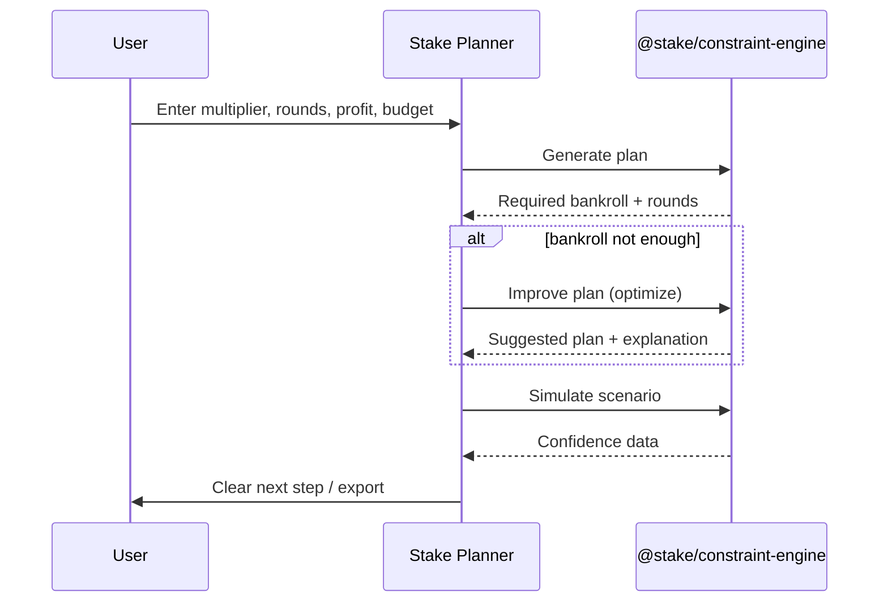

# Stake Planner

**A betting planning application** powered by [`@stake/constraint-engine`](PUBLIC_API.md).

Help users create a plan, adjust it when bankroll is tight, understand why it works, and keep it with confidence — in under 30 seconds, without reading documentation.

| | |
| --- | --- |
| **Product** | Stake Planner — in development · [stake-planner.vercel.app](https://stake-planner.vercel.app) |
| **Platform** | `@stake/constraint-engine` v1.0.0-rc.1 — stable |
| **License** | [MIT](LICENSE) |

---

## What Stake Planner does

```text
Generate Plan  →  Improve Plan  →  Understand Plan  →  Keep Plan  →  Trust Plan
```

| Feature | Goal |
| ------- | ---- |
| **Generate Plan** | User enters parameters and gets a betting plan |
| **Improve Plan** | When bankroll is not enough, still get a feasible suggestion |
| **Understand Plan** | Simulation + explanation — user trusts the result |
| **Keep Plan** | Export for later |
| **Trust Plan** | Polish — loading, microcopy, confidence |

Product spec: [`docs/rfc/product/`](docs/rfc/product/README.md) · Roadmap: [`ROADMAP.md`](ROADMAP.md) · Status: [`docs/PROJECT-STATUS.md`](docs/PROJECT-STATUS.md)

---

## User journey



---

## Getting started (developers)

Clone and run the app (monorepo):

```bash
git clone https://github.com/Ekergodmear/manageMoney.git
cd manageMoney
pnpm install
pnpm verify
```

Requires **Node.js ≥ 22**.

| Script | Description |
| ------ | ----------- |
| `pnpm dev` | Stake Planner UI (dev) |
| `pnpm build:app` | Product build → `dist-app/` |
| `pnpm build:lib` | Platform SDK → `dist/` |
| `pnpm verify` | lint + typecheck + test + build |

**Contributing:** see [CONTRIBUTING.md](CONTRIBUTING.md) — platform vs product vs UI.

---

## Architecture (platform)

Stake Planner is built on **`@stake/constraint-engine`** — a constraint-based planning SDK.

```text
Stake Planner (product)     src/features/, src/pages/, apps/
        ↓ imports only
@stake/constraint-engine    src/public/index.ts → dist/
        ↓
Engine modules              src/core/ (validation, solver, optimization, …)
```

| Layer | Path | Docs |
| ----- | ---- | ---- |
| Product UI | `src/features/`, `src/pages/` | `docs/rfc/product/` |
| Public API | `src/public/index.ts` | [`PUBLIC_API.md`](PUBLIC_API.md) |
| Engine | `src/core/` | [`docs/CORE-STABILITY.md`](docs/CORE-STABILITY.md) |
| SDK cookbook | `docs/cookbook/` | Workflows for package consumers |
| Example consumer | `examples/minimal-consumer/` | `pnpm example:minimal-consumer` |

Platform capabilities: `validateCalculationRequest`, `solve`, `buildStrategy`, `buildStatistics`, `optimize`, `simulateWinAtRound`.

SDK install (external consumers): `npm install @stake/constraint-engine` — see [`docs/cookbook/README.md`](docs/cookbook/README.md).

---

## License

[MIT](LICENSE)
