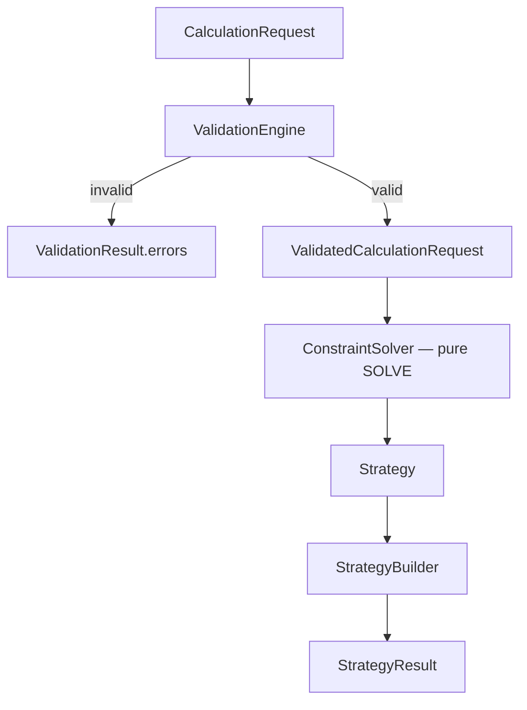

# Mathematical Specification

**Status:** APPROVED — Sprint 2.1C (amendments applied)  
**Version:** 2.0.0  
**Purpose:** Authoritative math definition before ValidationEngine (2.2) and ConstraintSolver (2.3).

When this document conflicts with casual code or Memory Bank drafts, **this file wins** until implemented and tested.

See: `docs/DOMAIN-LANGUAGE.md`, `docs/CONTRACTS.md`, `docs/FLOWS.md`.

**Out of scope:** plugin architecture — **Sprint 4**, after a working solver.

---

## 1. Problem Statement

Given a validated calculation request, compute a **deterministic sequence of bets** such that:

> If the user **wins at round i**, net profit at round i is at least the target defined by `targetProfit.mode`.

The engine does **not** predict wins. It only sizes bets so that a win at any round satisfies the profit constraint.

---

## 2. Terminology

| Symbol  | Domain field        | Meaning                                     |
| ------- | ------------------- | ------------------------------------------- |
| `M`     | `rewardMultiplier`  | Reward multiplier (must be > 1)             |
| `B_min` | `minimumBet`        | Floor bet per round                         |
| `S`     | `betStep`           | Bet increment (all bets are multiples of S) |
| `N`     | `roundCount`        | Number of rounds                            |
| `P*`    | from `targetProfit` | Target profit if win at current round       |
| `bᵢ`    | `betAmount`         | Bet in round i                              |
| `Aᵢ₋₁`  | `accumulatedSpent`  | Sum of bets **before** round i (`A₀ = 0`)   |
| `Aᵢ`    | `accumulatedSpent`  | Sum of bets **through** round i (inclusive) |
| `Rᵢ`    | `rewardAmount`      | `bᵢ × M` if round i wins                    |
| `πᵢ`    | derived             | `Rᵢ − Aᵢ` (profit if win at round i)        |

All amounts are **positive integers** in implementation (see §9 Rounding Policy).

---

## 3. Profit Constraint (canonical form)

Define the constraint in **domain language first**. Algebraic forms are derived from this.

### 3.1 ProfitConstraint (round i)

If the user wins at round i:

```text
ProfitConstraint(i):

  rewardAmount − (accumulatedSpent_before + betAmount)  ≥  targetProfit
```

Using symbols:

```text
Rᵢ − (Aᵢ₋₁ + bᵢ)  ≥  P*
```

Equivalently (profit definition):

```text
πᵢ  ≥  P*     where     πᵢ = Rᵢ − Aᵢ     and     Aᵢ = Aᵢ₋₁ + bᵢ
```

**Why this form:** If payout rules change later (fees, tax, bonus), update the **profit definition** once. Proofs reference `ProfitConstraint`, not a rearranged formula.

### 3.2 Algebraic derivation (current payout model)

Given `Rᵢ = bᵢ × M`:

```text
bᵢ × M − (Aᵢ₋₁ + bᵢ)  ≥  P*
bᵢ × (M − 1) − Aᵢ₋₁   ≥  P*
bᵢ × (M − 1)          ≥  Aᵢ₋₁ + P*
```

Minimum bet before step rounding:

```text
bᵢ  ≥  (Aᵢ₋₁ + P*) / (M − 1)
```

> **Deprecated:** `(A + P*) / M` in `.memory-bank/algorithms.md` — **incorrect** for general `betStep`.

### 3.3 Step rounding and floor

```text
bᵢ = max( B_min, ceil_to_step( (Aᵢ₋₁ + P*) / (M − 1) ) )

ceil_to_step(x) = ceil(x / S) × S
```

Then:

```text
Rᵢ = bᵢ × M
Aᵢ = Aᵢ₋₁ + bᵢ
```

---

## 4. Target Profit by Mode

| `targetProfit.mode` | `P*`                                                                                                                 |
| ------------------- | -------------------------------------------------------------------------------------------------------------------- |
| `breakEven`         | `0`                                                                                                                  |
| `fixedAmount`       | `targetProfit.amount`                                                                                                |
| `percentage`        | `floor(AccumulatedSpentBeforeRound × targetProfit.percentage / 100)` — **not** RequiredBankroll, **not** current bet |

---

## 5. Solver Boundary (pure function)

> **ConstraintSolver MUST NOT know about UI, DTO transport, ValidationEngine, or Optimization.**

| Layer                | Input                             | Output                                   |
| -------------------- | --------------------------------- | ---------------------------------------- |
| ValidationEngine     | `CalculationRequest`              | `Result<ValidatedCalculationRequest, …>` |
| **ConstraintSolver** | **`ValidatedCalculationRequest`** | **`Strategy`**                           |
| StrategyBuilder      | `Strategy` + context              | `Strategy` (normalized)                  |
| StatisticsBuilder    | `Strategy` + context              | `StrategyStatistics`                     |
| Application          | orchestration                     | `StrategyResult`                         |

```typescript
// Same fields as CalculationRequest — semantic marker that validation passed.
type ValidatedCalculationRequest = CalculationRequest;

function solve(validated: ValidatedCalculationRequest): Result<Strategy, SolverError>;
```

No side effects. No I/O. No logging in core solver path.

---

## 6. Pseudo-code

```text
SOLVE(validated):
  M ← validated.rewardMultiplier
  B_min ← validated.minimumBet
  S ← validated.betStep
  N ← validated.roundCount
  A ← 0
  rounds ← []

  FOR i FROM 1 TO N:
    P* ← RESOLVE_TARGET(validated.targetProfit, A)
    raw ← (A + P*) / (M - 1)          // integer-safe path — see §9
    b ← CEIL_TO_STEP(raw, S)
    IF b < B_min: b ← B_min
    R ← b × M
    A ← A + b
    APPEND Round { index: i, betAmount: b, rewardAmount: R, accumulatedSpent: A }

  RETURN Strategy { rounds }
```

**Postcondition:** ∀i : `ProfitConstraint(i)` holds.

---

## 7. Flowchart



---

## 8. Invariants

| ID  | Rule                                                                      |
| --- | ------------------------------------------------------------------------- |
| I1  | `Rᵢ − Aᵢ ≥ P*` (ProfitConstraint) for all i                               |
| I2  | `bᵢ ≥ B_min`                                                              |
| I3  | `bᵢ mod S = 0`                                                            |
| I4  | `Aᵢ = Aᵢ₋₁ + bᵢ`; hence `Aᵢ > Aᵢ₋₁` when `bᵢ > 0` (validated `B_min > 0`) |
| I5  | `Rᵢ = bᵢ × M` (exact integer)                                             |
| I6  | All amount fields are integers                                            |
| I7  | Same `ValidatedCalculationRequest` → same `Strategy`                      |
| I8  | `Aᵢ = Σ bₖ` for k = 1..i (accumulatedSpent equals sum of bets)            |

I8 is the primary structural check for ConstraintSolver unit tests.

---

## 9. Complexity & Execution Model

| Property      | Value                                                                                                            |
| ------------- | ---------------------------------------------------------------------------------------------------------------- |
| **Time**      | O(N) — one pass, O(1) work per round                                                                             |
| **Memory**    | O(N) — store N `Round` objects                                                                                   |
| **Streaming** | **Supported** — round i computed from `Aᵢ₋₁` only; can emit round without storing full history if caller streams |
| **Parallel**  | **Not applicable** — round i depends on `Aᵢ₋₁`; sequential by definition                                         |

No backtracking. No search. No randomness.

---

## 10. Rounding Policy (Numerical Stability)

All monetary amounts use **integer arithmetic** in the smallest currency unit (e.g. đồng, cent).

### 10.1 Rules

| Rule                 | Policy                                                                                                                                           |
| -------------------- | ------------------------------------------------------------------------------------------------------------------------------------------------ |
| Amount type          | Integers only for `betAmount`, `rewardAmount`, `accumulatedSpent`, `profitAmount`                                                                |
| Division             | Use **integer ceiling** toward +∞ for step alignment — never `Math.floor` for bet sizing                                                         |
| Percentage `P*`      | `floor(A × percentage / 100)` — integer division, round **down** target (conservative)                                                           |
| `(A + P*) / (M − 1)` | Compute with integers: `numerator = A + P*`, `denominator = M - 1`, then `ceil_to_step(numerator / denominator)` using **integer ceil division** |
| Float prohibition    | Do **not** use `Math.ceil(x / S) * S` on floating-point intermediates for money                                                                  |
| Safe range           | Reject inputs where any intermediate exceeds `Number.MAX_SAFE_INTEGER` (ValidationEngine §11.3)                                                  |

### 10.2 Integer ceil-to-step (reference implementation)

```text
CEIL_TO_STEP(numerator, denominator, S):
  // Minimum integer b such that b >= numerator/denominator and b mod S = 0
  raw_min ← CEIL_DIV(numerator, denominator)    // ceil(numerator / denominator), integer only
  RETURN CEIL_DIV(raw_min, S) × S

CEIL_DIV(a, b):
  RETURN (a + b - 1) // b    // integers, b > 0
```

### 10.3 When Amount migrates to bigint / Decimal

Rounding policy moves to a single module; **ProfitConstraint (§3.1) unchanged**.

---

## 11. Proof of Correctness

### 11.1 Local Optimality

**Claim:** For fixed `Aᵢ₋₁`, `P*`, `M`, `S`, `B_min`, the greedy bet is the **smallest valid integer bet**.

Let `f(b) = b×M − (Aᵢ₋₁ + b) = b×(M−1) − Aᵢ₋₁` (profit if win).  
`df/db = M − 1 > 0`. On the discrete grid: `f(b + S) = f(b) + S×(M−1) > f(b)`.

Valid bets satisfy `f(b) ≥ P*`, i.e. `b ≥ (Aᵢ₋₁ + P*)/(M−1)`.

Let `b* = max(B_min, ceil_to_step((Aᵢ₋₁ + P*)/(M−1)))`.

For any valid `b' < b*`:

- If `b' < B_min` → invalid (violates I2).
- If `b' < ceil_to_step(...)` → `b' × (M−1) < Aᵢ₋₁ + P*` → `f(b') < P*` → **violates ProfitConstraint**.

Therefore no smaller bet is valid. **∎**

Greedy chooses the minimum feasible bet at each round (local optimum among valid bets).

### 11.2 Global Optimality (minimum total bankroll)

**Do not assume** “greedy is optimal” without assumptions. Below is the proof **under explicit scope**.

#### Assumptions (A1–A7)

| ID  | Assumption                                                                                                                |
| --- | ------------------------------------------------------------------------------------------------------------------------- |
| A1  | Round i depends only on `Aᵢ₋₁` and request parameters — no look-ahead                                                     |
| A2  | **No maximum bankroll cap**                                                                                               |
| A3  | **No maximum bet cap** (only `B_min` floor and step)                                                                      |
| A4  | **No transaction fees, tax, or bonus** — `Rᵢ = bᵢ × M` exactly                                                            |
| A5  | Objective: minimize `requiredBankrollAmount = Σ bᵢ` subject to PrimaryConstraint at **every** round                       |
| A6  | **Decision space is discrete** — every `bᵢ ∈ D` where `D = { B_min + k×S \| k ≥ 0 }`; integer ceil-to-step (§10)          |
| A7  | **Target profit is path-independent of win/loss** — `P*ᵢ` depends on `TP` and `Aᵢ₋₁` only, not on outcome of prior rounds |

> **Terminology:** Algorithm paper uses **PrimaryConstraint** (= `ProfitConstraint` below). Future Optimization adds Secondary / Soft constraints (Sprint 3).

#### Claim

Under A1–A7, the greedy algorithm (§6) minimizes total bankroll.

#### Proof (Lemma 1 → Theorem)

Rounds are **sequentially dependent**: `Aᵢ = Aᵢ₋₁ + bᵢ`. Global optimality requires more than pointwise local bounds.

**Lemma 1 (monotone minimal feasible bet).**  
Let `g(A) = P*` from `RESOLVE_TARGET` (non-decreasing in `A` for all modes).  
Then `SOLVE_MINIMAL_FEASIBLE_BET(A, g(A), M, B_min, S)` is **non-decreasing** in `A` — larger spent-before cannot lower the minimal aligned bet.

**Lemma 2 (state recurrence).**  
Any valid strategy: `Aᵢ = Aᵢ₋₁ + bᵢ` with `bᵢ ≥ B_min > 0` → `Aᵢ > Aᵢ₋₁`.

**Theorem (greedy globally optimal).**  
Induction on round `i`: if `Aᵢ₋₁' ≥ Aᵢ₋₁^G`, then any valid `bᵢ' ≥ MFB(Aᵢ₋₁') ≥ MFB(Aᵢ₋₁^G) = bᵢ^G`, so `Aᵢ' ≥ Aᵢ^G`.  
Base `i = 1`: `A₀' = A₀^G = 0` → `b₁' ≥ b₁^G` by §11.1.  
Therefore `Σ bᵢ' ≥ Σ bᵢ^G`. Greedy achieves equality. **∎**

Full constructive proof: `docs/design/constraint-solver-constructive-proof.md` §9.

#### When assumptions break

| Added constraint                  | Consequence                                                                           |
| --------------------------------- | ------------------------------------------------------------------------------------- |
| Maximum bet cap                   | Greedy may be invalid; need constrained optimization (Sprint 3 `OptimizationRequest`) |
| Maximum bankroll                  | May need to reduce N or reject request — not pure greedy                              |
| Fees on payout                    | Update §3.1 profit definition; re-derive algebra                                      |
| Different objective (min max bet) | Different algorithm — OptimizationEngine Sprint 3                                     |

---

## 12. Validation Taxonomy (Sprint 2.2)

ValidationEngine classifies errors into three layers. **DTO carries no validation.**

### 12.1 Structural Validation

Shape and type sanity — reject before business rules.

| Check                              | Example failure                 |
| ---------------------------------- | ------------------------------- |
| Required fields present            | missing `roundCount`            |
| `undefined`, `null`                | any field                       |
| `NaN`, `Infinity`                  | `rewardMultiplier`              |
| Non-integer where integer required | `roundCount = 1.5`              |
| Wrong discriminant                 | `targetProfit.mode = "unknown"` |

### 12.2 Business Validation

Domain rules from user/product.

| Check                        | Example failure        |
| ---------------------------- | ---------------------- |
| `rewardMultiplier ≤ 1`       | M = 1                  |
| `roundCount < 1`             | N = 0                  |
| `minimumBet ≤ 0`             | B_min = 0              |
| `betStep ≤ 0`                | S = 0                  |
| `minimumBet mod betStep ≠ 0` | 10,500 / 1,000         |
| `fixedAmount.amount < 0`     | −1                     |
| `percentage < 0`             | −5                     |
| `percentage > 1000`          | 1001 (cap per product) |

### 12.3 Mathematical Validation

Feasibility and numeric safety — reject before solver.

| Check                        | Example failure                                                                     |
| ---------------------------- | ----------------------------------------------------------------------------------- |
| Overflow risk                | intermediate > `MAX_SAFE_INTEGER`                                                   |
| Impossible percentage target | P\* exceeds reachable profit given N, M, B_min                                      |
| Infeasible configuration     | no bet satisfies ProfitConstraint even at B_min (ValidationEngine proves or bounds) |

Output: `ValidatedCalculationRequest` only when all three layers pass.

---

## 13. Manual Proof (worked examples)

Shared parameters unless noted: `M = 20`, `B_min = 10,000`, `S = 1,000`.

### 13.1 fixedAmount — Round 1 (canonical)

`targetProfit = { mode: "fixedAmount", amount: 100_000 }`

```text
A₀ = 0, P* = 100,000
ProfitConstraint: b×20 − (0 + b) ≥ 100,000  →  b×19 ≥ 100,000  →  b ≥ 5,263.16…
b₁ = ceil_to_step(5,263.16) = 6,000 → max(10,000) = 10,000
R₁ = 200,000, A₁ = 10,000
π₁ = 200,000 − 10,000 = 190,000 ≥ 100,000 ✓
```

### 13.2 fixedAmount — Round N (N = 50, last round)

Same target; `N = 50`.

```text
A₄₉ = 1,439,000  (computed forward from rounds 1–49)
P* = 100,000
raw = (1,439,000 + 100,000) / 19 = 81,000 exactly
b₅₀ = 81,000
R₅₀ = 1,620,000, A₅₀ = 1,520,000
π₅₀ = 1,620,000 − 1,520,000 = 100,000 ≥ 100,000 ✓
requiredBankrollAmount = 1,520,000
```

Round 12 checkpoint: `b₁₂ = 12,000`, `π₁₂ = 118,000 ✓` (see v1.0 §11.2).

5-round subset: all bets `10,000`, bankroll `50,000` — matches fixture `fixed-profit-x20-5-rounds.json`.

### 13.3 breakEven — Round 1 and Round N

`targetProfit = { mode: "breakEven" }`, `N = 3`.

| Round | Aᵢ₋₁   | P\* | bᵢ     | πᵢ (if win)   |
| ----- | ------ | --- | ------ | ------------- |
| 1     | 0      | 0   | 10,000 | 190,000 ≥ 0 ✓ |
| 2     | 10,000 | 0   | 10,000 | 180,000 ≥ 0 ✓ |
| 3     | 20,000 | 0   | 10,000 | 170,000 ≥ 0 ✓ |

`requiredBankrollAmount = 30,000`. All rounds clamped to `B_min` when `P* = 0`.

### 13.4 percentage — Round 1 and Round 2

`targetProfit = { mode: "percentage", percentage: 10 }`, `N = 3`.

| Round | Aᵢ₋₁   | P\* = floor(A×10/100) | bᵢ     | πᵢ                |
| ----- | ------ | --------------------- | ------ | ----------------- |
| 1     | 0      | 0                     | 10,000 | 190,000 ≥ 0 ✓     |
| 2     | 10,000 | 1,000                 | 10,000 | 180,000 ≥ 1,000 ✓ |
| 3     | 20,000 | 2,000                 | 10,000 | 170,000 ≥ 2,000 ✓ |

Percentage target grows with spent; bets stay at floor for this parameter set.

---

## 14. Responsibility Split

| Layer               | Sprint  | Role                                         |
| ------------------- | ------- | -------------------------------------------- |
| DTO                 | 2.1B ✅ | `CalculationRequest` — shape only            |
| ValidationEngine    | 2.2 ✅  | §12 taxonomy → `ValidatedCalculationRequest` |
| ConstraintSolver    | 2.3     | §6 SOLVE — bet sequence → `Strategy`         |
| StrategyBuilder     | 2.4     | Transform sequence → domain `Strategy`       |
| StatisticsBuilder   | 2.5     | Derived metrics → `StrategyStatistics`       |
| SimulationEngine    | 2.6     | Read-only evaluation                         |
| OptimizationEngine  | 3       | `OptimizationRequest` — breaks A2/A3         |
| Plugin architecture | 4       | Extract after proven solver                  |

---

## 15. Approval Gate

- [x] ProfitConstraint in domain language (§3.1)
- [x] Formula `(M − 1)` confirmed
- [x] Local optimality proof (§11.1)
- [x] Global optimality proof with assumptions A1–A5 (§11.2)
- [x] Rounding policy (§10)
- [x] Invariant I8 (§8)
- [x] Validation taxonomy (§12)
- [x] Manual proof: fixed Round 1, fixed Round N, breakEven, percentage (§13)
- [x] Solver boundary: `ValidatedCalculationRequest` → `Strategy` (§5)
- [x] User approved v2.0.0

**Sprint 2.2 ValidationEngine is unlocked.**

After Sprint 2.2: implement ConstraintSolver (2.3) — **no further API design**.
