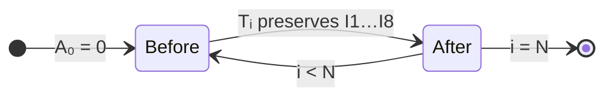

# ConstraintSolver — State Machine (Sprint 2.3C)

**Status:** **FROZEN** — approved 2025-06-25  
**Parent:** `docs/design/constraint-solver-algorithm.md` §5–§6  
**Prerequisite:** 2.3B **FROZEN**

Do not change without major version bump + new ADR.

---

## 1. Overview

ConstraintSolver is a **deterministic finite-state process** over `N` rounds.

Each iteration has **two explicit state nodes** connected by a **mathematical transition** (§3).

```text
AccumulatedSpentBefore   (Aᵢ₋₁)
        ↓
   Transition Tᵢ         (pure, total, deterministic — §3, §5, §10)
        ↓
AccumulatedSpentAfter    (Aᵢ)
```

---

## 2. Solver state (no hidden state)

```text
Solver State = AccumulatedSpent only.
```

**Does not exist:**

- cache
- history buffer (beyond emitted `Round` output)
- mutable global variables
- previous reward
- previous profit
- win/loss flags

Round `i` is fully determined by `(ValidatedCalculationRequest, Aᵢ₋₁)`.  
Enables streaming, benchmarking, and future parallel analysis of independent transitions.

---

## 3. State definitions

| Name                       | Symbol | Meaning                                 |
| -------------------------- | ------ | --------------------------------------- |
| **AccumulatedSpentBefore** | `Aᵢ₋₁` | Sum of bets before round `i`            |
| **AccumulatedSpentAfter**  | `Aᵢ`   | Sum of bets through round `i` inclusive |

```text
Aᵢ = Aᵢ₋₁ + bᵢ
```

**Persisted on `Round`:** `accumulatedSpent` = **`AccumulatedSpentAfter`** (`Aᵢ`) only.

---

## 4. Mathematical transition (round i)

```text
AccumulatedSpentBefore  (Aᵢ₋₁)
        ↓
P*ᵢ = RESOLVE_TARGET(TP, Aᵢ₋₁)
        ↓
bᵢ = SOLVE_MINIMAL_FEASIBLE_BET(Aᵢ₋₁, P*ᵢ, M, B_min, S)    [bᵢ ∈ D]
        ↓
Rᵢ = bᵢ × M
        ↓
AccumulatedSpentAfter  (Aᵢ = Aᵢ₋₁ + bᵢ)
        ↓
EMIT Round { index: i, betAmount: bᵢ, rewardAmount: Rᵢ, accumulatedSpent: Aᵢ }
```

**PrimaryConstraint (post-transition):** `Rᵢ − Aᵢ ≥ P*ᵢ`

**Transition preserves I1–I8** (§9).

---

## 5. Deterministic transition

> **Transition is deterministic.**

```text
∀ request, Aᵢ₋₁, i:
  Tᵢ(request, Aᵢ₋₁) is unique
```

Same `(ValidatedCalculationRequest, AccumulatedSpentBefore, roundIndex)` → same `(AccumulatedSpentAfter, bᵢ, Rᵢ)`.

---

## 6. Total transition function

> **Transition is a total function** on valid inputs.

For every **validated** `ValidatedCalculationRequest` and every **reachable** `Aᵢ₋₁ ≥ 0`:

```text
Tᵢ : (request, Aᵢ₋₁) → exactly one Aᵢ
```

- No undefined branch
- No early exit inside the round loop
- `SOLVE_MINIMAL_FEASIBLE_BET` always returns `bᵢ ∈ D`
- `Aᵢ = Aᵢ₋₁ + bᵢ` always defined (integers)

Reachable states: `A₀ = 0` and all `Aᵢ` produced by prior transitions.  
ValidationEngine ensures infeasible configurations never reach the solver.

Formal verification (2.3F) will assert totality + determinism on fixtures.

---

## 7. Transition diagram

```text
                    ┌──────────────────────────────────────────┐
                    │  INIT: AccumulatedSpentBefore ← 0, i ← 1   │
                    └────────────────────┬─────────────────────┘
                                         │
         ┌───────────────────────────────▼───────────────────────────────┐
         │  NODE: AccumulatedSpentBefore  (Aᵢ₋₁)                          │
         └───────────────────────────────┬───────────────────────────────┘
                                         │
              ┌──────────────────────────▼──────────────────────────┐
              │  Tᵢ — preserves I1…I8 (§9)                             │
              │    P*ᵢ ← RESOLVE_TARGET(TP, Aᵢ₋₁)                    │
              │    bᵢ  ← SOLVE_MINIMAL_FEASIBLE_BET(...)   [bᵢ ∈ D]    │
              │    Rᵢ  ← bᵢ × M                                    │
              │    Aᵢ  ← Aᵢ₋₁ + bᵢ                                   │
              └──────────────────────────┬──────────────────────────┘
                                         │
         ┌───────────────────────────────▼───────────────────────────────┐
         │  NODE: AccumulatedSpentAfter  (Aᵢ)                               │
         │  EMIT Round { bᵢ, Rᵢ, accumulatedSpent: Aᵢ }                     │
         └───────────────────────────────┬───────────────────────────────┘
                                         │
                              i < N ? ──yes──┐
                                         │   │
              AccumulatedSpentBefore ← Aᵢ  │   │
                                         │   │
                                         └───┘
                                         │
                                        no → RETURN Strategy
```

---

## 8. Transition table

| Step    | Symbol  | Formula                                                               |
| ------- | ------- | --------------------------------------------------------------------- |
| Enter   | `Aᵢ₋₁`  | `AccumulatedSpentBefore`                                              |
| Resolve | `P*ᵢ`   | `RESOLVE_TARGET(TP, Aᵢ₋₁)`                                            |
| Solve   | `bᵢ`    | `SOLVE_MINIMAL_FEASIBLE_BET(Aᵢ₋₁, P*ᵢ, M, B_min, S)` — `bᵢ ∈ D`       |
| Reward  | `Rᵢ`    | `bᵢ × M`                                                              |
| Update  | `Aᵢ`    | `Aᵢ₋₁ + bᵢ`                                                           |
| Emit    | `Round` | `{ index: i, betAmount: bᵢ, rewardAmount: Rᵢ, accumulatedSpent: Aᵢ }` |
| Next    | `Aᵢ₋₁`  | `← Aᵢ` for round `i + 1`                                              |

---

## 9. Transition preserves invariants

Each application of `Tᵢ` **preserves I1–I8**:

| ID  | Preserved because                                        |
| --- | -------------------------------------------------------- |
| I1  | `SOLVE_MINIMAL_FEASIBLE_BET` satisfies PrimaryConstraint |
| I2  | `max(B_min, …)`                                          |
| I3  | `CEIL_TO_STEP` → `bᵢ ∈ D`                                |
| I4  | `Aᵢ = Aᵢ₋₁ + bᵢ`; `bᵢ > 0` → `Aᵢ > Aᵢ₋₁`                 |
| I5  | `Rᵢ = bᵢ × M` by construction                            |
| I6  | integer-only arithmetic                                  |
| I7  | `Tᵢ` deterministic (§5)                                  |
| I8  | `Aᵢ = Aᵢ₋₁ + bᵢ` extends running sum                     |

Sprint 2.3F tests re-assert after every transition on all fixtures.

---

## 10. Mermaid



---

## 11. Approval gate (2.3C)

- [x] Mathematical transition form (§4)
- [x] No hidden state (§2)
- [x] Deterministic + total transition (§5–§6)
- [x] Transition preserves I1–I8 (§9)
- [x] User approved — **FROZEN** 2025-06-25
